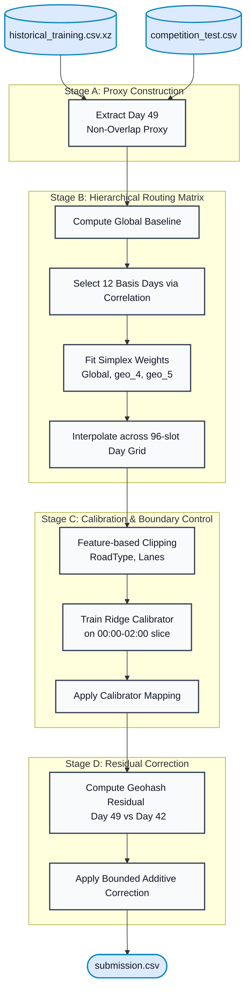

# GridLock 2.0 Forecasting Pipeline


GridLock 2.0 is a traffic intelligence hackathon organized by Flipkart in partnership with Bengaluru Traffic Police and hosted on HackerEarth. Phase 1 is an online machine learning challenge with a live leaderboard, where participants submit models against the provided task and improve them over multiple submissions. The official competition page is [GridLock 2.0 on HackerEarth](https://gridlock2point0.hackerearth.com/).

This repository packages the Phase 1 forecasting pipeline used for the Day 49 demand prediction task, together with a script, companion notebooks, model artifact, and local evaluation files.

## Quick start

```bash
pip install -r requirements.txt
python gridlock_release_pipeline.py
```

The final predictor is not a neural network. It combines:
- a hierarchical basis-day routing matrix,
- a ridge regression calibrator,
- and a bounded geohash residual correction.

## Repository layout

```text
GridLock 2.0/
├── README.md
├── requirements.txt
├── gridlock_release_pipeline.py
├── notebooks/
│   ├── gridlock_release_pipeline.ipynb
│   └── gridlock_eda_companion.ipynb
├── data/
│   ├── competition_train.csv
│   ├── competition_test.csv
│   ├── evaluation_ground_truth.csv
│   └── historical_training.csv.xz
├── artifacts/
│   ├── gridlock_release_model.pkl
│   ├── submission.csv
│   └── validation_summary.json
└── scripts/
    ├── prepare_data_bundle.py
    ├── unpack_historical_data.py
    └── build_release_archive.py
```

## Forecasting method



The pipeline uses four stages.

### 1. Day 49 non-overlap proxy
The competition test horizon is Day 49 from `02:15` to `13:45`.  
The pipeline uses Day 49 labels outside this interval as a clean proxy:
- `00:00` to `02:00`
- `14:00` to `23:45`

### 2. Hierarchical routing matrix
- historical `(geohash, time_min)` mean baseline
- twelve basis days selected by correlation against the proxy
- simplex-constrained routing weights at:
  - global slot level
  - `geo_4` slot level
  - `geo_5` slot level
- interpolation from observed proxy slots to the full 96-slot grid

### 3. Calibration and boundary control
- feature-side clipping using:
  - `RoadType`
  - `NumberofLanes`
  - `LargeVehicles`
- ridge calibration on the observed Day 49 competition slice (`00:00` to `02:00`)

### 4. Geohash residual correction
- bounded additive geohash residual derived from Day 49 non-overlap slots relative to Day 42

## Data handling

The package includes:
- the official competition train split
- the official competition test split
- the evaluation ground-truth file used for local scoring
- the historical training file in compressed `xz` form

The release pipeline reads the compressed historical file directly.  
If direct compressed loading fails in a target environment, the release pipeline automatically extracts `historical_training.csv` from `historical_training.csv.xz` and continues from the extracted CSV.

## Execution

Install dependencies:

```bash
pip install -r requirements.txt
```

Run the release pipeline:

```bash
python gridlock_release_pipeline.py
```

The release pipeline writes:
- `artifacts/gridlock_release_model.pkl`
- `artifacts/submission.csv`
- `artifacts/validation_summary.json`

Prepare or refresh the data bundle:

```bash
python scripts/prepare_data_bundle.py
```

Unpack the historical file:

```bash
python scripts/unpack_historical_data.py
```

Build the curated archive:

```bash
python scripts/build_release_archive.py
```

Open the companion EDA notebook:

```bash
notebooks/gridlock_eda_companion.ipynb
```

## Results

Final score:
- `95.007143%` R²

Historical proxy-fold validation:
- mean: `91.746914%`
- median: `94.389219%`

Inference telemetry:
- rows written: `41,778`
- missing predictions: `0`
- basis days: `12`
- calibration rows: `7,872`

## Data source and disclaimer

This repository packages the competition train split, competition test split, local evaluation ground truth, and compressed historical file used by the pipeline.

The historical source is credited to the Kaggle dataset `kweklydia5/grabtrafficdata`, which is also referenced in the pipeline for optional local download resolution through `kagglehub`.

Dataset ownership, competition rules, and redistribution terms remain with the original competition and dataset authors. Users should review the relevant competition page, Kaggle dataset page, and platform terms before reusing or redistributing the bundled data files.
